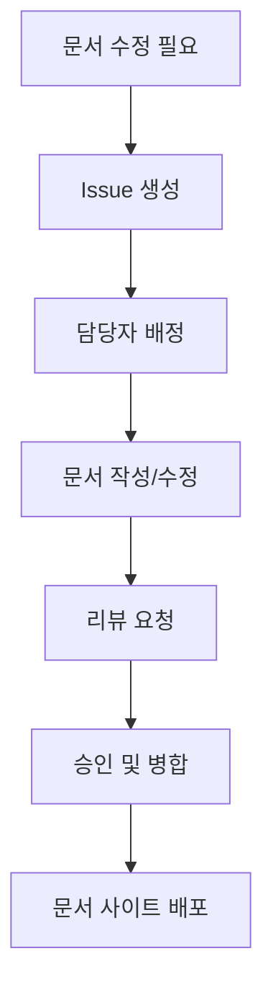

# 📚 문서 센터

조직의 모든 문서와 가이드를 한 곳에서 찾을 수 있습니다.

## 📋 목차

### 🚀 시작하기
- [빠른 시작 가이드](./quick-start.md)
- [설치 가이드](./installation.md)
- [첫 번째 프로젝트](./first-project.md)

### 🔧 개발 가이드
- [개발 환경 설정](./development-setup.md)
- [코딩 스타일 가이드](./coding-style.md)
- [API 문서](./api-reference.md)
- [테스트 가이드](./testing.md)

### 🏗️ 아키텍처
- [시스템 아키텍처](./architecture.md)
- [데이터베이스 설계](./database-design.md)
- [보안 아키텍처](./security-architecture.md)

### 🚀 배포 및 운영
- [배포 가이드](./deployment.md)
- [모니터링 설정](./monitoring.md)
- [트러블슈팅](./troubleshooting.md)
- [백업 및 복원](./backup-restore.md)

### 👥 팀 협업
- [워크플로우](./workflow.md)
- [코드 리뷰 가이드](./code-review.md)
- [릴리스 프로세스](./release-process.md)

### 📊 프로젝트 관리
- [프로젝트 구조](./project-structure.md)
- [의존성 관리](./dependency-management.md)
- [버전 관리](./version-control.md)

### 🔒 보안
- [보안 가이드라인](./security-guidelines.md)
- [취약점 관리](./vulnerability-management.md)
- [접근 제어](./access-control.md)

### 🎯 사용자 가이드
- [사용자 매뉴얼](./user-manual.md)
- [FAQ](./faq.md)
- [지원 받기](./support.md)

## 🔍 빠른 검색

| 찾고 있는 것 | 문서 |
|-------------|------|
| 🏁 바로 시작하고 싶어요 | [빠른 시작 가이드](./quick-start.md) |
| 🔧 개발 환경을 설정하고 싶어요 | [개발 환경 설정](./development-setup.md) |
| 🐛 버그를 발견했어요 | [이슈 리포팅](./issue-reporting.md) |
| 🚀 새로운 기능을 제안하고 싶어요 | [기능 요청](./feature-request.md) |
| 📝 코드를 기여하고 싶어요 | [기여 가이드](../CONTRIBUTING.md) |
| 🔐 보안 문제를 신고하고 싶어요 | [보안 정책](../SECURITY.md) |

## 📖 문서 기여하기

### 🖊️ 문서 작성 가이드
- [마크다운 스타일 가이드](./markdown-style.md)
- [문서 템플릿](./templates/)
- [스크린샷 가이드](./screenshot-guide.md)

### 📝 문서 개선 제안
1. [Issues](../../issues)에서 문서 개선 제안
2. [Pull Request](../../pulls)로 직접 수정
3. [Discussions](../../discussions)에서 아이디어 토론

### 🔄 문서 업데이트 프로세스


## 🛠️ 문서 도구

### 📚 문서 생성 도구
- **VuePress**: 정적 사이트 생성기
- **Mermaid**: 다이어그램 도구
- **PlantUML**: UML 다이어그램
- **Swagger**: API 문서

### 🔧 로컬 문서 서버 실행
```bash
# 문서 사이트 로컬 실행
npm run docs:dev

# 문서 빌드
npm run docs:build

# 문서 배포
npm run docs:deploy
```

## 📈 문서 통계

| 항목 | 수량 |
|------|------|
| 📄 총 문서 수 | 50+ |
| 🔄 월 업데이트 | 15+ |
| 👥 기여자 수 | 12+ |
| 🌟 문서 평점 | 4.8/5 |

## 🎯 문서 로드맵

### 2024년 Q1
- [ ] API 문서 자동화
- [ ] 인터랙티브 튜토리얼
- [ ] 다국어 지원 (한국어, 영어)

### 2024년 Q2
- [ ] 비디오 튜토리얼
- [ ] 문서 검색 개선
- [ ] 모바일 최적화

### 2024년 Q3
- [ ] AI 기반 문서 어시스턴트
- [ ] 실시간 협업 기능
- [ ] 문서 분석 대시보드

## 🤝 도움이 필요하신가요?

### 💬 소통 채널
- **이메일**: docs@organization.com
- **Slack**: #documentation
- **Discord**: [문서 채널](https://discord.gg/organization)

### 📞 지원 시간
- **평일**: 09:00 - 18:00 (KST)
- **주말**: 응급 상황만
- **응답 시간**: 24시간 이내

---

**좋은 문서는 좋은 소프트웨어의 시작입니다.** 📖✨ 